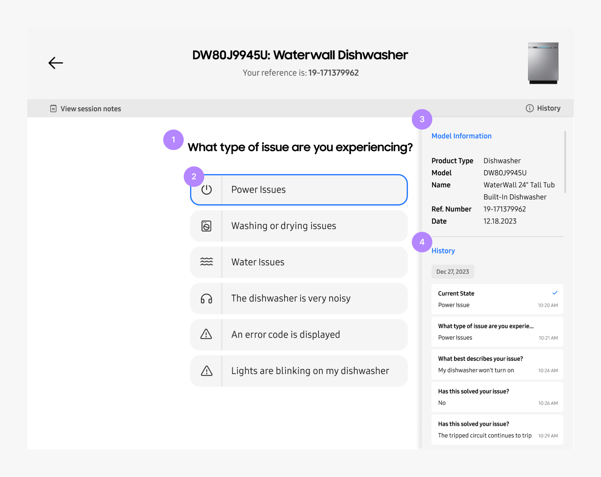

# Agent Portal

Allows agents to offer training modules, guides, and other resources to better understand and troubleshoot the product.

 
 

| No. Title            | Text                                                                   |
| -------------------- | ---------------------------------------------------------------------- |
| 1. Questions         | Question about the product issue that a customer might be experiencing |
| 2. Answers           | Answer options that a customer might reply with                        |
| 3. Model Information | Detail information about the product that is being troubleshooted      |
| 4. History           | Auto-saved history states that an agent took while troubleshooting     |
