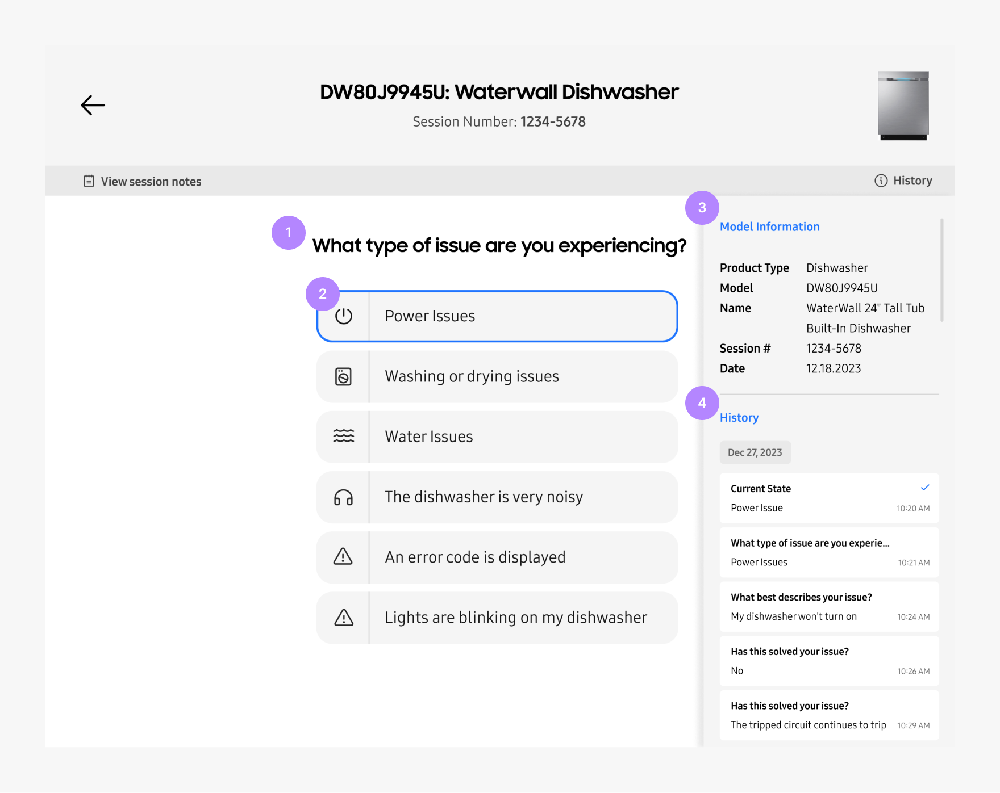

# Agent Portal

Allows agents to offer training modules, guides, and other resources to better understand and troubleshoot the product.

 
 

| No. Title            | Text                                                                   |
| -------------------- | ---------------------------------------------------------------------- |
| 1. Questions         | Question about the product issue that a customer might be experiencing |
| 2. Answers           | Answer options that a customer might reply with                        |
| 3. Model Information | Detail information about the product that is being troubleshooted      |
| 4. History           | Auto-saved history states that an agent took while troubleshooting     |

## Future Releases

  
  <ol>
  <li>Add different types of node. E.g. Regular node, Conditional node, Link node, Tree-link node.
  </li>
  <li>Assign status to the nodes. For e.g. Success, In-progress, failure, etc.
  </li>
  <li><b>Orphanage</b>, a place to view all the abandoned orphan nodes from where you can copy and link it to different parts of the tree.
  </li>
  </ol>

