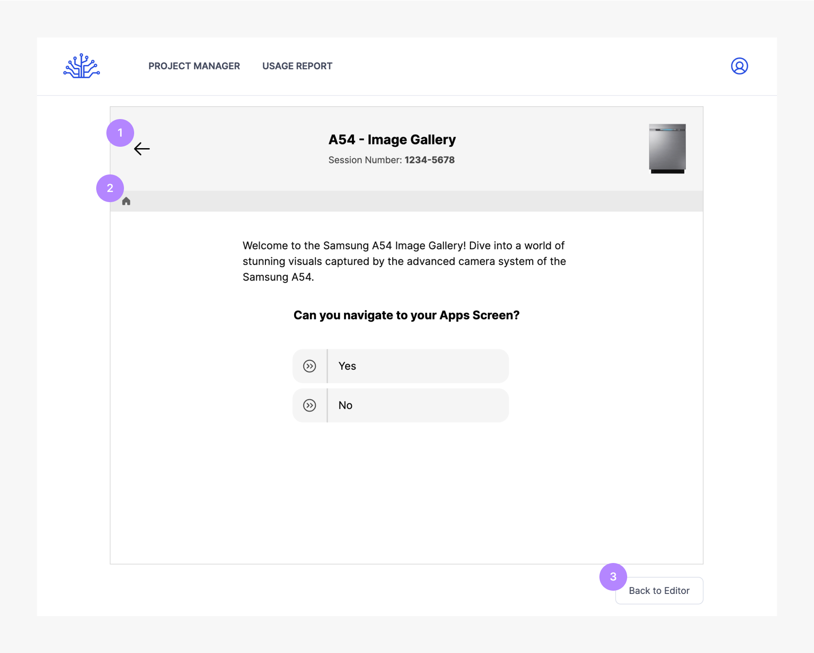

# Preview Mode
Visualize how a tree looks on the front-end.

| No. Title            | Text                                                              |
| ---------------------| ----------------------------------------------------------------- |
| 1. Back arrow       | Go back to previous node                                          |
| 2. Breadcrumb       | Allows you to navigate & the path taken to the current node        |
| 3. Back to Editor   | Takes you back to the editor view                                  |

