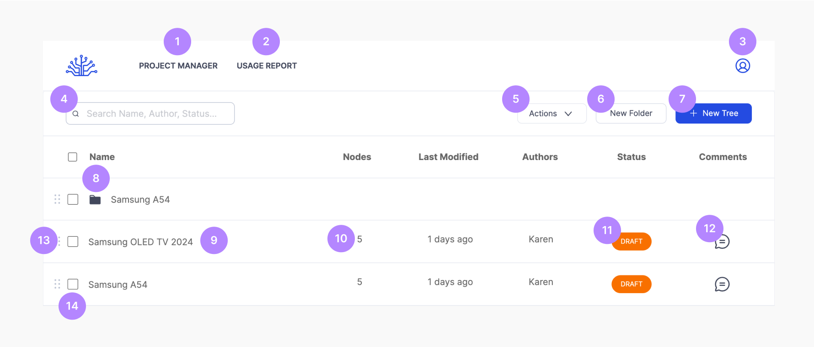
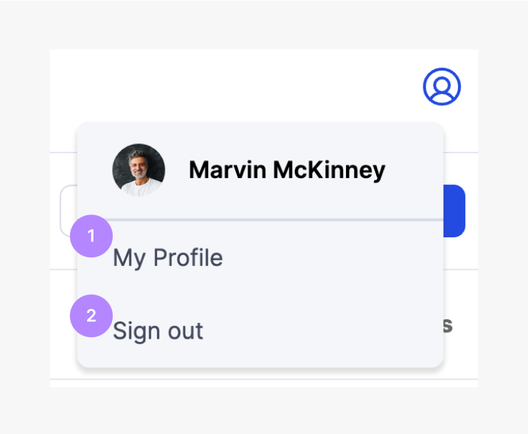
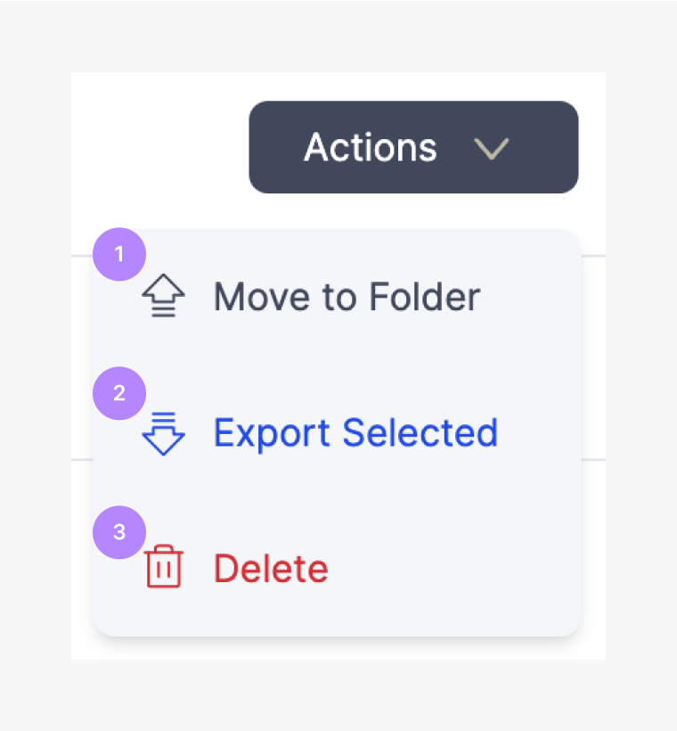

# Project Manager

This component allows you to create and manage D-Trees.

 
 

| No. Title           | Text                                                                                  |
| ------------------- | ------------------------------------------------------------------------------------- |
| 1. Project Manager  | Opens the project manager                                                             |
| 2. Usage Report     | Link to the Usage Report page                                                         |
| 3. Profile Icon     | Access to profile menu                                                                |
| 4. Search Bar       | Filter the trees and folders by name, author, status                                  |
| 5. Actions Dropdown | List of options that allow users to perform different tasks on selected tree          |
| 6. New Folder       | Create a folder                                                                       |
| 7. New Tree         | Create new tree                                                                       |
| 8. Folder           | Group of trees                                                                        |
| 9. Tree             | Decision tree                                                                         |
| 10. Nodes           | Count the total number of nodes in the tree         |
| 11. Status          | Current status of the Tree e.g. Draft or Published  |
| 12. Comments        | View comments left on the Tree                      |
| 13. Drag & Drop     | Arrange trees by clicking and dragging              |
| 14. Select D-Tree   | Multi-select check box that allows user to perform different tasks                    |

## Profile Icon

This component lets you manage your profile.

 
 

| No. Title     | Text                      |
| ------------- | ------------------------- |
| 1. My Profile | Link to user profile page |
| 2. Sign out   | Sign out of your profile  |

## Actions Dropdown

This component allows you to perform different task on the selected folders & trees.

 
 

| No. Title          | Text                                                                      |
| ------------------ | ------------------------------------------------------------------------- |
| 1. Move to Folder  | Move selected tree(s) into a folder                                       |
| 2. Export Selected | Export tree data into different format  |
| 3. Delete          | Delete selected tree or folder                                            |

