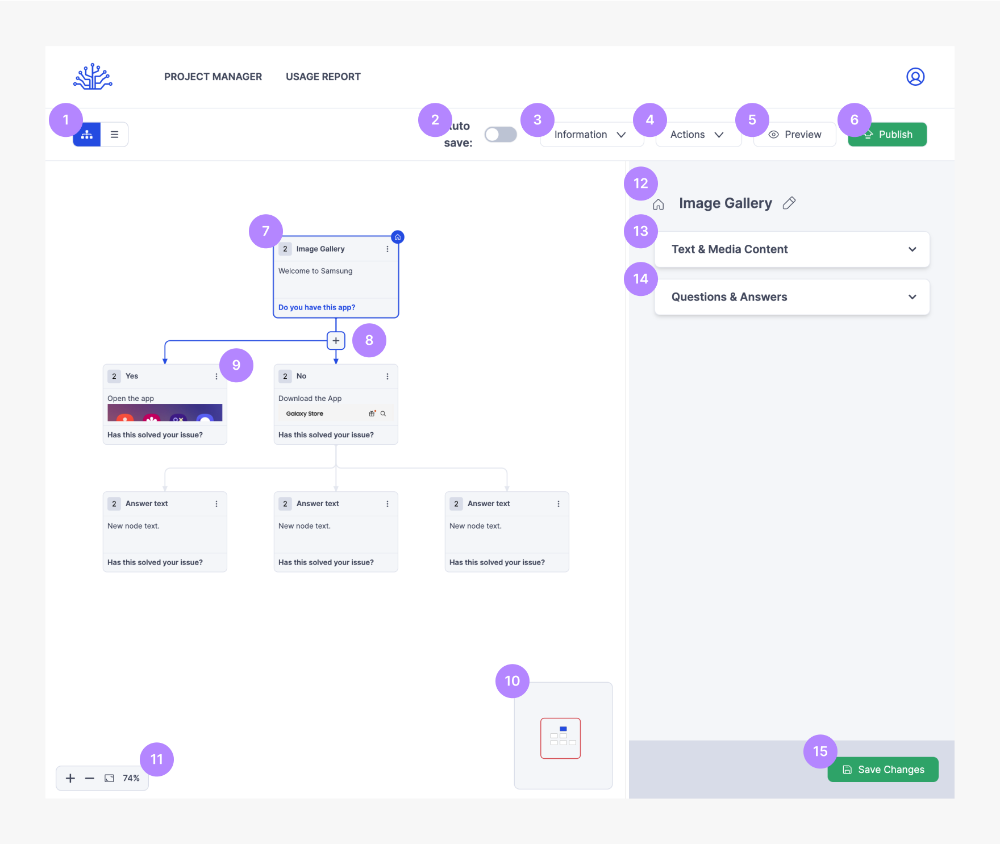
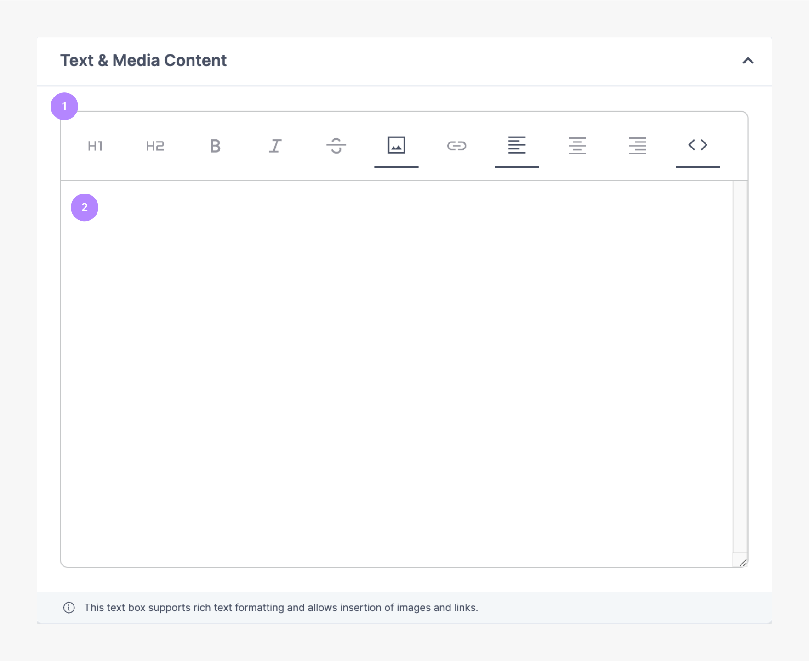
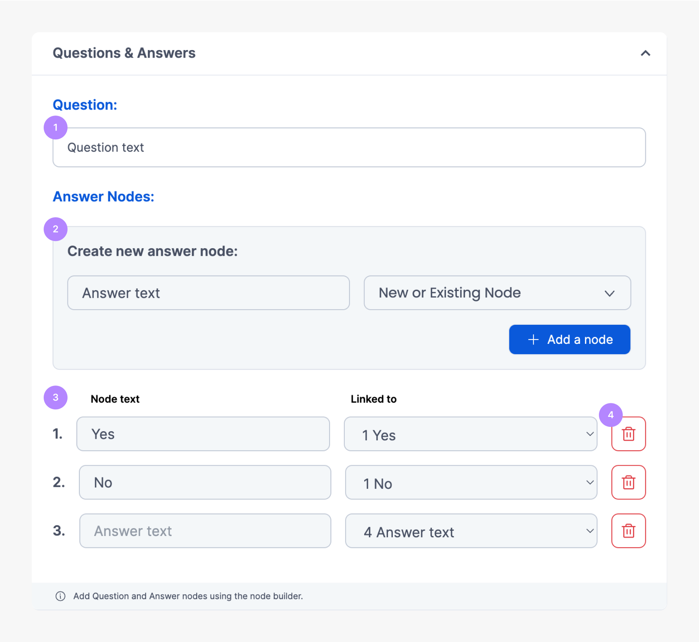

# Tree Builder

This component allows you to create new or edit trees.

 
 

| No. Title                | Text                                                                 |
| ------------------------ | -------------------------------------------------------------------- |
| 1. View Toggle           | Visualize the tree as it is being built. E.g. Tree view or List view |
| 2. Auto-save             | Automatically save updates in your trees                             |
| 3. Information           | Related details of the tree                                          |
| 4. Actions               | Additional features that a user can perform                          |
| 5. Preview               | Visualize how the end-product looks                                  |
| 6. Publish               | Set the tree as live                                                 |
| 7. Node                  | Visual representation of the node                                    |
| 8. Add Node button       | Adds a new node in the tree                                          |
| 9. Node Menu             | Options related to the selected node                                 |
| 10. Navigator            | Pan around the tree using the navigation                             |
| 11. Zoom in/out          | Zoom in or out of the tree                                           |
| 12. Node Title           | Edit the title of the selected node                                  |
| 13. Text & Media Content | Description of the selected node                                     |
| 14. Questions & Answers  | Add questions and answers                                            |
| 15. Save Changes         | Save all the changes performed on the tree                           |

## Text & Media Content

This component allows you add images & descriptions on the selected node.

 
 

| No. Title           | Text                                                                           |
| ------------------- | ------------------------------------------------------------------------------ |
| 1. Rich Text Editor | Panel to edit properties of the description, adding images and links, and code |
| 2. Description      | Add descriptions for the node                                                  |

## Questions & Answers

This component allows you create questions and answer nodes

 
 

| No. Title               | Text                                                                 |
| ----------------------- | -------------------------------------------------------------------- |
| 1. Question             | Add questions on the node                                            |
| 2. Answer node          | Create new answer node, this can be linked to a new or existing node |
| 3. Existing answer node | List of current answer nodes                                         |
| 4. Delete               | Delete answer node                                                   |

